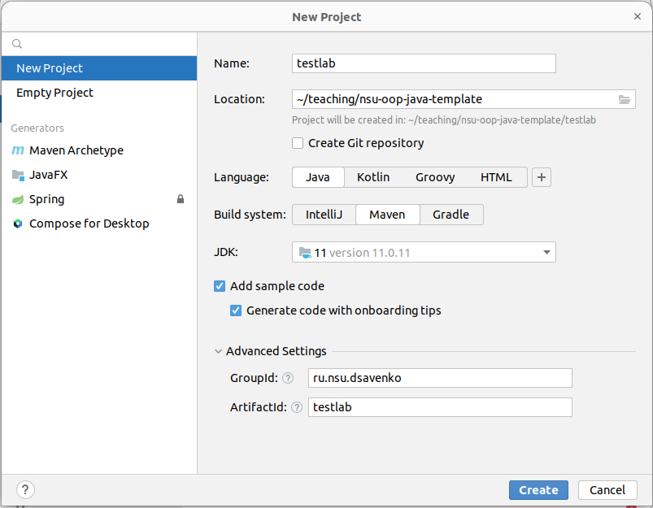
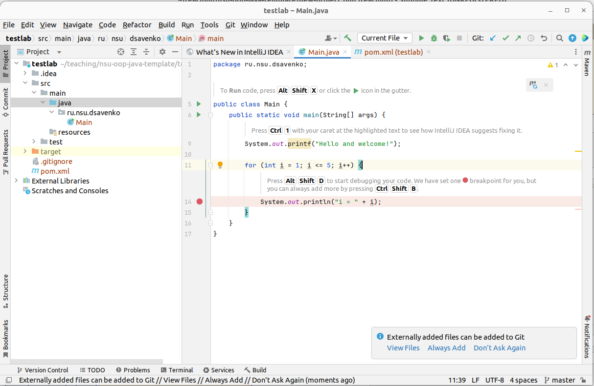

# Заготовка репозитория для лабораторных по курсу "ООП на Java" ФИТ НГУ

## Краткая справка, как работать с Git и GitHub

Некоторые шаги ниже вы, возможно, уже делали раньше.

1. Заводим аккаунт на GitHub.
2. Устанавливаем Git на вашем компьютере (для Windows качаем [отсюда](https://git-scm.com/download/win)).
3. Если у вас Windows, открываем папку, где хотим хранить задачи и выбираем в контекстном меню `Open Git Bash here`.
4. Создаем SSH-ключ и привязываем его к аккаунту на GitHub, следуя инструкциям [отсюда](https://github.com/settings/keys).
5. Нажимаем `Use this template -> Create a new repository` на этой странице, открывается окно создания нового репозитория на основе данного. Вводим имя, **выбираем Private**, жмем `Create repository`.
6. На странице вашего репозитория идём в `Settings -> Collaborators -> Add people`, вводим мой аккаунт (`dsavenko`), нажимаем `Add ...`.
6. В окне Git Bash выполняем команду `git clone <git-ссылка>`. Git-ссылку можно получить на странице вашего репозитория (нажав кнопку `Code`), она имеет вид `git@github.com:dsavenko/nsu-oop-java-template.git`. 
7. В папке с названием вашего репозитория теперь лежит его локальная копия, с которой вы можете работать.

Как работать с локальной копией:
1. Создаёте, удаляете, меняете файлы и папки, как вам нужно.
2. Чтобы залить изменения на GitHub, открываете `Git Bash` в папке вашего репозитория и выполняете следующие команды:
    ```
    $ git add .
    $ git commit -m "Краткое описание изменений"
    $ git push
    ```
3. Проверяем, что всё залито успешно, командой `git status`: 
    ```
    $ git status
    On branch master
    Your branch is up to date with 'origin/master'.

    nothing to commit, working tree clean
    ```
    Если вывела такое, то всё ОК.
4. Коммитить и пушить рекомендуется **часто**, как минимум один раз за каждый день, когда вы работали.

**Рекомендуется самостоятельно изучить работу с Git более подробно.** Набираете в поисковике "основы Git и GitHub (под Windows)" и выбираете любую понравившуюся статью или ролик на YouTube. Для более основательного изучения рекомендую [Git Book](https://git-scm.com/book/ru/v2). Git является стандартом индустрии, и эти знания вам точно пригодятся.

## Что нужно установить

Установите (убедитесь, что установлено):

1. [Java](https://docs.oracle.com/en/java/javase/20/install/installation-jdk-microsoft-windows-platforms.html) версии не ниже 11. Нам нужно именно JDK (есть еще JRE, его будет недостаточно). Проверьте, что команда `java -version` запускается с командной строки (cmd).
2. [Intellij IDEA community edition](https://www.jetbrains.com/ru-ru/idea/download/#section=windows) (бесплатная). Если у вас есть лицензия - еще лучше, но бесплатной версии достаточно.
3. [Мавен](https://maven.apache.org/). Проверьте, что команда `mvn -version` запускается с командной строки (cmd).

По желанию можете поставить вместо Идеи Eclipse ([Eclipse IDE for Java Developers](https://www.eclipse.org/downloads/packages/)). 

Мавен - это система сборки (как CMake), являющаяся стандартом индустрии в мире Java. Все ваши проекты должны будут собираться мавеном.

## Как создать новый проект в Intellij IDEA

1. После запуска IDEA нажимаем `New project`
2. Заполняем поля как показано на скриншоте:



* `Name` - название проекта, можно `lab1`, например.
* `Location` - выбираем папку, куда вы клонировали репозиторий.
* `Create Git repository` - должно быть **выключено** (у вас уже есть репозиторий).
* `Build system` - убедитесь, что здесь стоит **Maven**.
* Раскройте `Advanced Settings`, и введите:
    * `GroupId` - верхнеуровневое имя вашего пакета. Существует общепринятое [соглашение об именовании пакетов](https://docs.oracle.com/javase/tutorial/java/package/namingpkgs.html). Если не знаете, что писать, можете ввести `ru.nsu.<ваша фамилия маленькими буквами>`.
    * `ArtifactId` - то же, что и Name.

3. Нажимаете `Create`, должны получить структуру папок и файлов, аналогичную тому, что лежит в папке [testlab](testlab). 



4. Дожидаемся сборки проекта (пока справа внизу не исчезнет прогресс бар).

5. Открываем класс `Main`, нажимаем зеленую стрелочку для запуска. Убеждаемся, что программа выводит `Hello and welcome!...`. 

> [!NOTE]
> В разные моменты времени IDEA может предлагать добавлять файлы в Git (на скриншоте выше - окошко справа внизу). Рекомендую всегда отказываться и работать с Git вручную, с командной строки. Это наиболее надежный способ, который позволит избежать многих ошибок и лучше освоить Git.

6. Добавляем вновь созданный проект в Git, делаем первый коммит и пуш. Для этого в командной строке из папки проекта:
```
$ git add .
$ git commit -m "Первый коммит"
$ git push
```

## Сборка и запуск с командной строки

Важно, чтобы ваш проект собирался и запускался с командной строки. Для этого делаем следующее:

1. Открываем командную строку (`cmd` в Windows) в папке проекта (например, [testlab](testlab)).

2. Набираем `mvn clean package` для полной (пере)сборки, дожидаемся завершения. В конце должно быть что-то подобное:
    ```
    [INFO] --- maven-jar-plugin:2.4:jar (default-jar) @ testlab ---
    [INFO] Building jar: /.../testlab/target/testlab-1.0-SNAPSHOT.jar
    [INFO] ------------------------------------------------------------------------
    [INFO] BUILD SUCCESS
    [INFO] ------------------------------------------------------------------------
    [INFO] Total time:  1.425 s
    [INFO] Finished at: 2024-01-31T10:20:39+07:00
    [INFO] ------------------------------------------------------------------------
    ```
    Это значит, что сборка прошла успешно, и ваша программа собрана в файл `target/testlab-1.0-SNAPSHOT.jar`. Программы на Java не собираются в нативные исполняемые файлы (exe). Вместо этого есть специальные форматы файлов, самый распространенный - это `jar` (сокращение от java archive).

3. Запускаем с командной строки следующим образом: 
    ```
    $ java -cp target/testlab-1.0-SNAPSHOT.jar ru.nsu.dsavenko.Main
    Hello and welcome!i = 1
    i = 2
    i = 3
    i = 4
    i = 5
    ```
    Здесь аргумент `-cp` - так называемый Classpath, вы должны указать jar-файл с вашей программой. После него идет полное имя запускаемого класса, то есть `<имя пакета>.<имя класса>`. 
